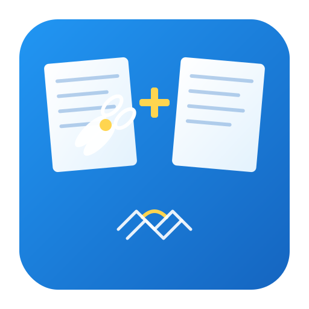

# Slice & Stich PDF

<p align="center">
  
</p>

<p align="center">
  <strong>Split and merge PDF files with ease</strong><br>
  A modern, user-friendly desktop application built with Python and PyQt6
</p>

<p align="center">
  
  
  
  
</p>

---

## ✨ Features

### 📄 Split PDF
- **Split by pages**: Extract individual pages or custom page ranges
- **Page range syntax**: Use intuitive notation like `1-3, 5, 8-10`
- **Custom file prefix**: Name your output files with custom prefixes
- **Live preview**: See your PDF pages before splitting

### 📎 Merge PDF
- **Combine multiple PDFs**: Merge unlimited PDF files into one
- **Drag & drop support**: Simply drag files into the application
- **Reorder files**: Arrange files in your preferred order
- **Live merge preview**: Preview the combined result before saving

### 🎨 User Experience
- **Light & Dark themes**: Toggle between themes with one click
- **Modern Material Design**: Clean, intuitive interface
- **PDF Preview**: View pages as thumbnails or single-page view
- **Splash screen**: Professional loading experience
- **Drag & Drop**: Effortlessly add files

---

## 🖥️ Screenshots

*Coming soon*

---

## 🚀 Installation

### Option 1: Download Standalone Executable (Recommended)
1. Go to the [Releases](../../releases) page
2. Download `Slice & Stich PDF v4.0.0.exe`
3. Run the executable - no installation required!

### Option 2: Run from Source

#### Prerequisites
- Python 3.8 or higher
- pip (Python package manager)

#### Steps

1. **Clone the repository**
   ```bash
   git clone https://github.com/DaxSapien/Slice-Stich-PDFV4.git
   cd Slice-Stich-PDFV4
   ```

2. **Create a virtual environment (recommended)**
   ```bash
   python -m venv venv
   
   # On Windows
   venv\Scripts\activate
   
   # On macOS/Linux
   source venv/bin/activate
   ```

3. **Install dependencies**
   ```bash
   pip install PyQt6 pypdf pymupdf
   ```

4. **Run the application**
   ```bash
   python main.py
   ```

---

## 📦 Building the Executable

To create a standalone `.exe` file:

1. **Install PyInstaller**
   ```bash
   pip install pyinstaller
   ```

2. **Build the executable**
   ```bash
   pyinstaller PDFMaster.spec
   ```

3. **Find your executable**
   The built file will be in the `dist/` folder.

---

## 🏗️ Project Structure

```
Slice & Stich PDFV4/
├── main.py                 # Application entry point
├── version.py              # Version configuration
├── PDFMaster.spec          # PyInstaller build specification
├── gui/                    # User interface modules
│   ├── window.py           # Main application window
│   ├── preview.py          # PDF preview components
│   ├── themes.py           # Light/dark theme stylesheets
│   └── splash.py           # Splash screen
├── logic/                  # Core business logic
│   ├── pdf_ops.py          # PDF split/merge operations
│   └── pdf_renderer.py     # PDF rendering for previews
├── assets/                 # Application assets
│   ├── icon.ico            # Windows icon
│   └── icon.svg            # Vector icon
└── README.md               # This file
```

---

## 🛠️ Technology Stack

| Component | Technology | Purpose |
|-----------|------------|---------|
| **GUI Framework** | PyQt6 | Modern cross-platform UI |
| **PDF Operations** | pypdf | Split, merge, and manipulate PDFs |
| **PDF Rendering** | PyMuPDF (fitz) | High-quality PDF preview generation |
| **Packaging** | PyInstaller | Standalone executable creation |

---

## 📖 Usage Guide

### Splitting a PDF

1. Click **"Select PDF"** or drag a PDF file to the Split tab
2. View the preview to see your PDF pages
3. *(Optional)* Enter specific page ranges (e.g., `1-3, 5, 7-10`)
4. *(Optional)* Set a custom file prefix
5. Click **"Split PDF"** and choose an output folder
6. Your split files will be saved with descriptive names

### Merging PDFs

1. Click **"Add Files"** or drag multiple PDFs to the Merge tab
2. Reorder files by dragging them in the list
3. Preview the merged result
4. Click **"Merge All"** and choose a save location
5. Your merged PDF is ready!

### Page Range Syntax

| Input | Result |
|-------|--------|
| `1-3` | Pages 1, 2, and 3 combined into one PDF |
| `5` | Just page 5 |
| `1-3, 5, 8-10` | Three PDFs: pages 1-3, page 5, and pages 8-10 |
| *(empty)* | Each page becomes a separate PDF |

---

## 🤝 Contributing

Contributions are welcome! Feel free to:

1. Fork the repository
2. Create a feature branch (`git checkout -b feature/amazing-feature`)
3. Commit your changes (`git commit -m 'Add amazing feature'`)
4. Push to the branch (`git push origin feature/amazing-feature`)
5. Open a Pull Request

---

## 📝 License

This project is open source and available under the [MIT License](LICENSE).

---

## 👤 Author

**Dax Sapien**  
*AntiGravity Projects*

---

## 🙏 Acknowledgments

- [PyQt6](https://www.riverbankcomputing.com/software/pyqt/) - Cross-platform GUI toolkit
- [pypdf](https://pypdf.readthedocs.io/) - PDF manipulation library
- [PyMuPDF](https://pymupdf.readthedocs.io/) - PDF rendering engine
- [PyInstaller](https://pyinstaller.org/) - Application packaging

---

<p align="center">
  Made with ❤️ and Python
</p>
